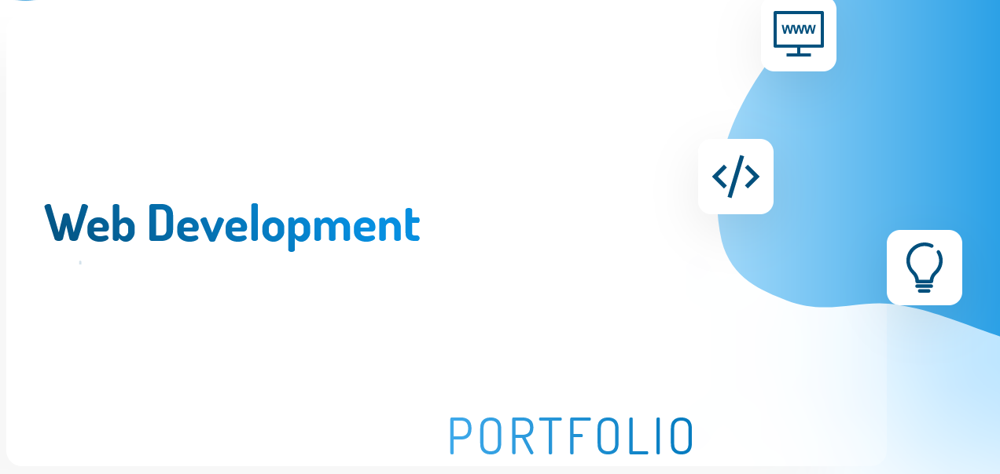

# Hello there ! Welcome on my portfolio :wave:

I'm a JavaScript developer whose main focus has been to build efficient, intuitive and elegant web applications. As for the tools that I use, I've been mainly interested in the MERN stack to develop my projects but I also enjoy discovering new technologies whenever I get the chance to do so.

## Technologies I feel more confortable around :rocket:

 

 

 

 

 

## Other technologies I've been twinkering with lately :zap:
 
 
 

 
 
 

## Projects I've recently worked on :fire:
| <b>🦜 Projects</b>    |  <b>📚 Repo</b>    | <b>💻 Demo</b>   |
| ------------- |:-------------:| -----:|
| E-commerce app built with svelte and strapi |  |    |
| Job Tracking App built with the MERN Stack. |  |    |
| Green youtube-clone built with the MERN Stack and Firebase. |  |    |
| House marketplace built with React and Firebase. |  |    |
| Multilingual admin dashboard built with React and i18next. |  |    |

## Contact me :speech_balloon:

## Check out my portfolio :star:

